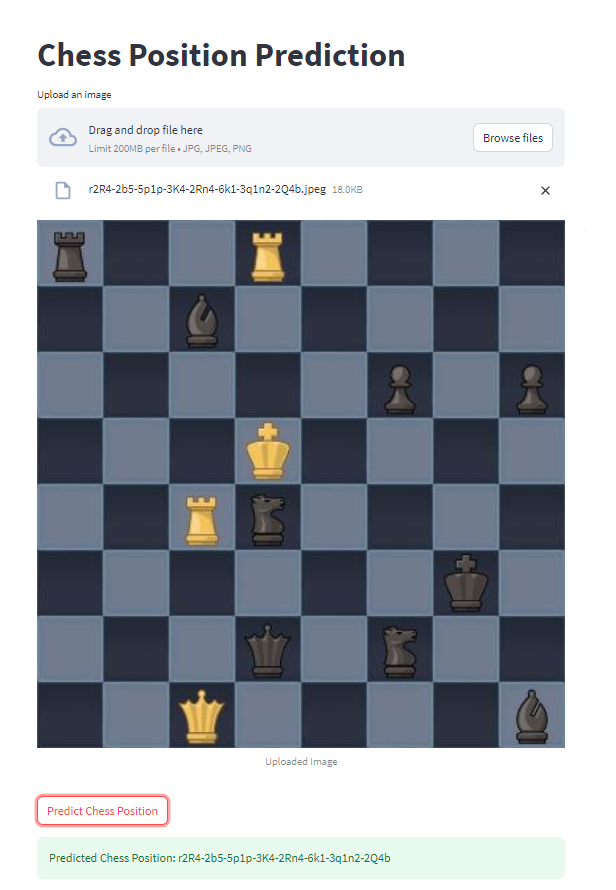

# Chess Position Prediction App

This repository contains a Streamlit web application for predicting chess positions using a Convolutional Neural Network (CNN) model. The app takes an input image of a chessboard and returns the predicted position in FEN (Forsyth-Edwards Notation) format.

## Screenshot

## Files

- `app.py`: The main Streamlit application script that allows users to interact with the model and predict chess positions.
- `app-screenshot.png`: A screenshot of the Streamlit app showing its user interface.
- `Chess-FEN-generation.ipynb`: A Jupyter Notebook containing the code and details of the chess position prediction model training process.
- `dataset/`: A directory containing the dataset used to train and test the model.
- `helpers.py`: A Python script containing helper functions used in the Streamlit app or model training.
- `model.h5`: A saved Keras model file with the trained CNN model used for chess position prediction.
- `requirements.txt`: A file listing all the Python dependencies required to run the Streamlit app.
- `training.py`: A Python script containing the code for training the CNN model on the chess position dataset.

## Installation

To run the Chess Position Prediction App locally, follow these steps:

1. Clone this repository: `git clone https://github.com/your-username/chess-position-prediction.git`
2. Change into the project directory: `cd chess-position-prediction`
3. Install the required dependencies: `pip install -r requirements.txt`
4. Run the Streamlit app: `streamlit run app.py`

## How to Use

1. After running the Streamlit app, a user interface will open in your web browser.
2. Upload an image of a chessboard to the app.
3. Click on the "Predict" button.
4. The app will display the predicted chess position in FEN notation.

## Acknowledgments

The development of this project was inspired by various resources from the Kaggle community and other open-source contributors. Some of the references include:

- [Chess FEN Generator](https://www.kaggle.com/code/koryakinp/chess-fen-generator/notebook)
- [Chess FEN Generator Improved](https://www.kaggle.com/code/meditech101/chess-fen-generator-improved)
- [Chess Positions FEN Prediction (EDA + CNN Model)](https://www.kaggle.com/code/ibrahimsoboh/chess-positions-fen-prediction-eda-cnn-model)

